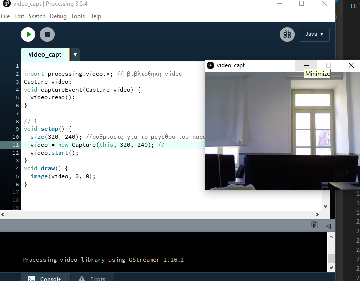
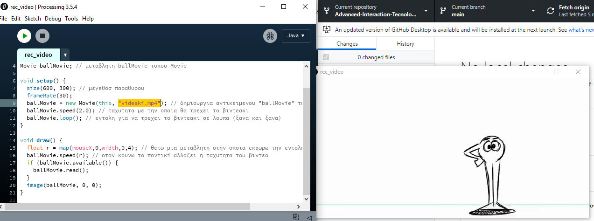
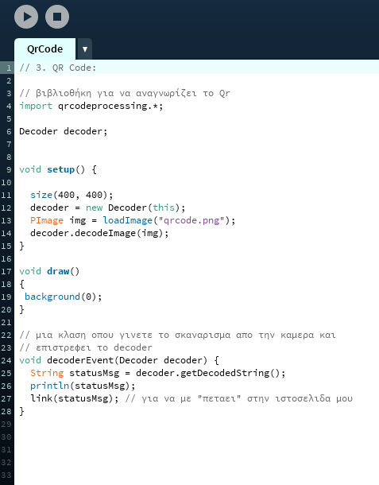
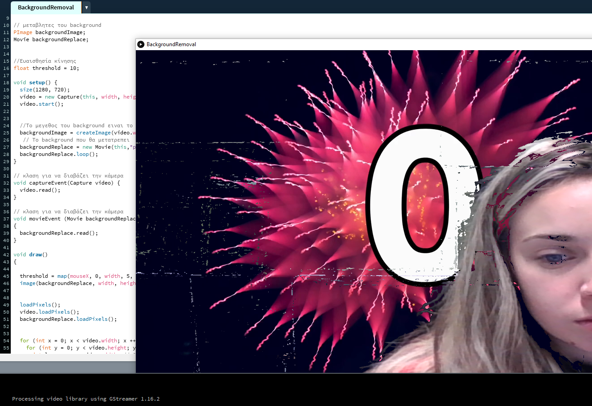
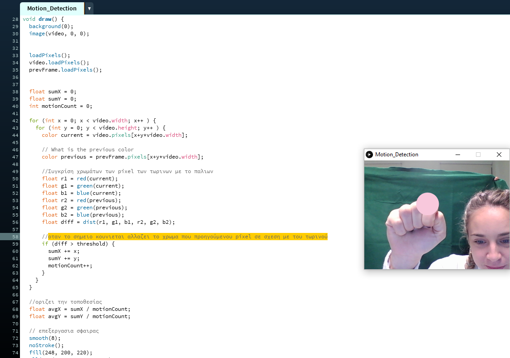
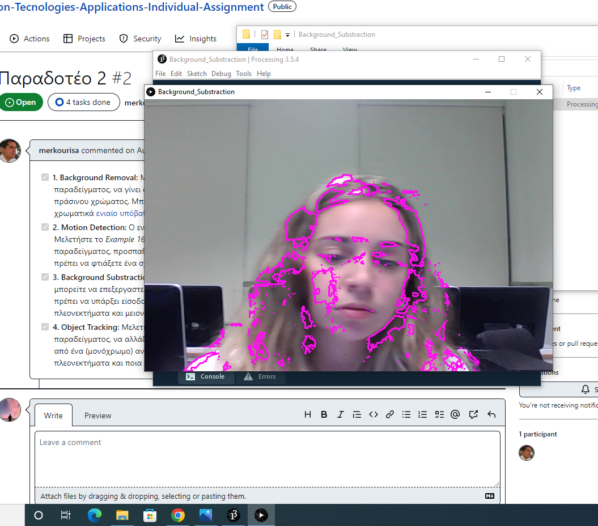
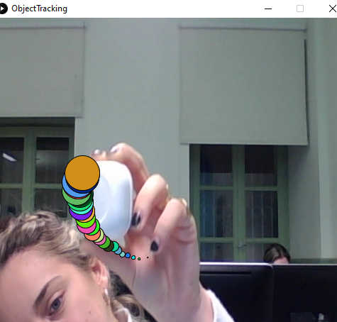

# Lesson: Advanced Interaction Technologies & Applications

### First and Last Name: Ioanna Ninou
### University Registration Number: dpsd19085
### GitHub Personal Profile: https://github.com/IoannaNi
### Advanced Interaction Tecnologies & Applications Github Personal Repository: https://github.com/IoannaNi/Advanced-Interaction-Tecnologies-Applications-Individual-Assignment

# Introduction

# Summary

# 1st Deliverable
 1. Video Capture:

    Για να ανοίξω την καμερα , δλδ να υλοποιησω το Video Capture χρειάστηκε να κατεβάσω την βιβλιοθήκη "Video library for processing 3" ,για να μπορει να αναγνωριζει τις εντολες απο  το Example 16-1 από το Learning Processing, 2nd Edition. 
    

 2. Recorded video:

    Για να περασω το βιντεακι και να ρυθμιζω εγω να παιζει αργα ή γρήγορα με το ποντίκι του υπολογιστή μου ακολουθησα τα παρακάτω βήματα. Αρχικα επελεξα ενα βιντεο των 10 δευτερολεπτων στο Youtube οπου και το εγκατεστησα στον υπολογιστη μου. Αφου  κατεβασα το βιντεακι ,το τοποθετησα σε εναν νεο φακελο που το ονομασα "data", το οποιο ειναι μεσα στο φακελο που ειναι το προγραμμα μου υλοποιησα το Exercise 16-2. Αφου πηρα το Exercise 16-2 ,εβαλα το αρχειο απο το βιντεο μου ("videaki.mp4"). 
    Υστερα κανω καποιεσ αλλαγεσ στον κωδικα. 

3. QR Code:
  Για να μπορεσω να εκτελεσω το ακολουθω προγραμμα, οπου εχω περασμενο ενα αρχειο png με το Qr code μου και αυτοματος να με "πετάει" στην σελίδα μου στο GitHub εκανα, εγκατεστησα μια βιβλιοθηκη QR code.
  Υστερα εφτιαξα το δικο μου QR, οπου το συνδεσα με το προφιλ μου στο GitHub. Εφτιαξα ενα καινουργιο προγραμμα με βαση τις οδηγίες του αναφέροντε στην σελίδα Processing QRCode Library και στην συνέχεια εκανα κάποιες αλλαγες. Οπως πρόσθεσα την εντολη  link(statusMsg); , ετσι ωστε να μου πεταει την ιστοσελιδα με το που κανει Decode η καμερα.

4. QR Code - Camera Read:
  Αρχικά αρχισα με το παραδειγμα QRCodeExample με την Qr εικονα μου. Εκανα τις απαραίτητες αλλαγες, δλδ αλλάξα το loadImage στην εικόνα που θελω να διαβάσεις τοποθετήσει την εικόνα μέσα στο data μου για να τη διαβάσει το πρόγραμμα.

5. Augmented Reality:
    Αφου κατεβασα την βιβλιοθηκη zxing4p3-v3.4 και ετρεξα το παραδειγμα simpleLite και ειδα πως τρεχει εκανα της εξης αλλαγες. Αρχικα εφτιαξα ενα δικο μου φακελο "simpleL" μεσα στον οποιο εκανα ενα νεο αρχειο του proseccing "simpleL" και ακολουθησα την ιδια διαδικασια οπωσ στα παραπανω . Εφτιαξα ενα φακελο με το ονομα "data" , περασα μεσα στον φακελο την εικονa που κατεβασα με το ονομα "pink.jpg". Υστερα έβαλα μια μεταβλητη που για την εικονα ετσι ωστε να αναγνωριζει την εικονα . Επειτα εγραψα αναλυτικα την διευθυνση τησ εικονας .
.png)

# 2nd Deliverable
 1. Background Removal:
   Για την πραγματοποίηση του Background Removal, δηλαδή για την αντικατάσταση υποβάθρου με ένα βίντεο. Με βοήθησε αρκετά η άσκηση 16.6 green screen, όπου έκανα κάποιες αλλαγές στον κώδικα. Αρχικά:

      α) με την εντολή "Movie backgroundReplace;" αρχειοθέτησα το όνομα της μεταβλητής του βίντεο, 

      β)στην συνέχεια δημιούργησα ένα καινούργιο αντικείμενο τύπου Movie και το εκχώρισα στο όνομα backgroundReplace ( backgroundReplace = new Movie(this,"pink.mp4");) 

      γ) Μια κλάση για να διαβάζει το βίντεο

         void movieEvent (Movie backgroundReplace) 
           {
              backgroundReplace.read();
            }   

      δ) Μέσα στην void draw πρόσθεσα την εντολή  "image(backgroundReplace, width, height); " για να ανακαλέσει το βίντεο. 
      Αύτες ήταν οι αλλαγές που έκανα στην άσκηση 16.6 για να πέτυχω το Background Removal.

      ΑΠΟΤΕΛΕΣΜΑΤΑ:

      

  2. Motion Detection:   
    Για να πετύχω ένα σχήμα να ακολουθεί ένα κινούμενο αντικέιμενο, πήρα ως παράδειγμα την άσκηση 16.7 και το μόνο που άλλαξα είναι το μέγεθος της σφαίρας και το χρώμα.

    Επίσης με την εντολή 

    if (diff > threshold) 
     {   sumX += x;
         sumY += y;
        motionCount++;}

    Όταν το σημειο κουνιεται αλλαζει το χρωμα που προηγούμενου pixel σε σχεση με του τωρινού.
    
    ΑΠΟΤΕΛΕΣΜΑΤΑ:
    
    
     

   3. Background Substraction - Library use:   
      Για το συγκεκριμένο χρειάστηκε να εγκαταστήσω την βιβλιοθήκη OpenCV, έπειτα πήρα βοήθεια απο το παράδειγμα "Background Substraction" και το μόνο που άλλαξα ήταν τα αρχεία για το βίντεο δλδ διέγραψα τα εξής:
      
        1) video = new Movie(this, "street.mov");
            opencv = new OpenCV(this, 720, 480);

         2)void movieEvent(Movie m) {
          m.read(); }

      και τα αντικατέστησα με:

       1) //αναγνωριση κάμερας 

            video = new Capture(this, 720, 480);  

          // ανοίγει η κάμερα  

            video.start();  

          // δημιουργία αντικειμένου της OpenCV

            opencv = new OpenCV(this, 720, 480); 

        2)//διαβάζει την καμερα 

           void captureEvent(Capture video) {

           video.read(); }

       
       ΑΠΟΤΕΛΕΣΜΑΤΑ:

       

   (*)ΕΡΩΤΗΣΗ:

   Ποια είναι τα πλεονεκτήματα και μειονεκτήματα της έτοιμης βιβλιοθήκης έναντι του κώδικα από το πρώτο ερώτημα;

      Με την OpenCV:
       (+) γίνεται πιο εύκολη η διαδικασία
       (+) αναλύει και εντοπίζει τα αντικείμενα της εικόνας 
       (+) αναγνωρίζει την κίνηση των μελών του σώματος 
       (+) είναι κατάλληλη βιβλιοθήκη για εφαρμογές που γίνεται χρήση κάμερας σε πραγματικό χρόνο
       (-) πρέπει να υπάρχει καλός φωτεισμός
       (-) χρειάζεται να εγκαταστήσω βιβλιοθήκη
      Ενώ με τον κώδικα (του πρώτου υποερωτήματος) έπρεπε να συγκρίνει καθε pixel με το προηγούμενό του. Για παράδειγμα  Όταν το σημειο κουνιεται αλλαζει το χρωμα που προηγούμενου pixel σε σχεση με του τωρινού.
      απαιτει περισσοτερο χρονο για την εμφάνιση της εικόνας.  
    
 4. Object Tracking:
    Αρχίκα άνοιξα την άσκηση "snake" το μόνο που άλλαξα ήταν μόνο στην κλάση και άλλαξα τα χαρακτηριστηκά της "ουράς" 

 ΑΠΟΤΕΛΕΣΜΑΤΑ:

 (*)ΕΡΩΤΗΣΗ:

  Σε σχέση με το παραδοσιακό ποντίκι ποια είναι τα πλεονεκτήματα και ποια τα μειονεκτήματα αυτής της τεχνικής ελέγχου ενός ή περισσότερων σημείων σε μια οθόνη?

   Η συγκεκριμένη τεχνική ελέγχου:

   (+) διαχείρηση απο απόστση

   (+) εύκολη πρόσβαση 

   (+) δεν χρειάζονται εξοπλησμός input παρα μόνο κάμερα

   (-) αναγκαστηκά κάμερα

   (-) μερικές φορές δεν είναι τόσο αποτελεσματικό

   (-) "κολλάει"

# 3rd Deliverable 

# Bonus 

# Conclusions

# Sources
videaki ("videaki.mp4" -> https://www.youtube.com/watch?v=zIKxshOqlAc )

download (https://y2mate.tools/en57ec)

qr (https://me-qr.com/qr-code-generator/qr)
